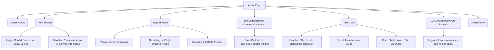

# About Page Architecture

This document outlines the structural layout and wireframe of the About Page, telling the story of the founders and the team behind the journeys.

## Component Tree

## Section Details & Enhancements (10x Perspective)
- **Story Timeline**: Built with a central vertical line that "fills" as the user scrolls down, connecting the alternating image/text blocks.
- **Team Grid**: Hovering over a team member's photo reveals their personal quote or philosophy, adding a human touch before the user even clicks.
- **Added 10x Element**: *Conservation Impact Stats*. In modern luxury travel, conservation is as important as the luxury itself. Explicitly showing the impact builds trust and aligns with the target audience's values.
