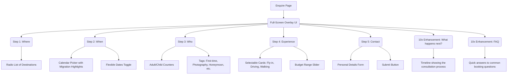

# Enquire Page Architecture

This document outlines the structural layout and wireframe of the Enquire Page, utilizing a Singita-inspired multi-step wizard to craft the perfect journey.

## Component Tree

## Section Details & Enhancements (10x Perspective)
- **Wizard UI**: A full-screen, distraction-free interface (no standard header/footer) that feels like an exclusive consultation rather than a generic contact form.
- **Background**: A subtle, very slow-moving aerial video adds atmosphere without distracting from the form fields.
- **Added 10x Element**: *What happens next?* Many users hesitate to fill out luxury forms because they fear immediate hard-sells. Setting expectations (e.g., "1. We review your request, 2. A specialist calls you, 3. We draft a zero-obligation itinerary") dramatically increases conversion rates.
