# Experience Page Architecture

This document outlines the structural layout and wireframe of the Experience Page, detailing the immersive categorization of safari adventures.

## Component Tree

```mermaid
graph TD
    A[Experience Page] --> B(Global Navbar)
    
    A --> C(Hero Section)
    C --> C1[First-person Video: Safari Drive]
    C --> C2[Headline: 'Every journey designed around what moves you']
    
    A --> D(Experience Categories)
    D --> D1[Masonry Grid Layout]
    D --> D2[Category: Wildlife Encounters]
    D --> D3[Category: Cultural Immersion]
    D --> D4[Category: Landscape & Light]
    D --> D5[Category: Conservation & Community]
    D --> D6[Category: Photography Safaris]
    D --> D7[Category: Wellness & Retreat]
    
    A --> E(10x Enhancement: Guest Testimonials)
    E --> E1[Slider with authentic guest quotes]
    E --> E2[Linking specific quotes to the experiences they had]
    
    A --> F(10x Enhancement: Our Approach)
    F --> F1[Text-heavy editorial section]
    F --> F2[Explanation of our 'Leave No Trace' ethos]

    A --> G(Global Footer)
```

## Section Details & Enhancements (10x Perspective)
- **Masonry Grid**: We use an uneven, organic masonry layout that breaks the traditional rigid grid, giving a more editorial, magazine-like feel.
- **Hover States**: Hovering on a category darkens the image, brings up the category title from the bottom with a spring animation, and fades in a "Discover →" CTA.
- **Added 10x Element**: *Guest Testimonials* linked directly to experiences, adding social proof and emotional connection right where users are deciding what type of trip they want.
