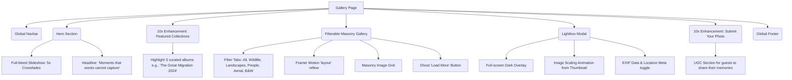

# Gallery Page Architecture

This document outlines the structural layout and wireframe of the Gallery Page, focusing on high-impact visual storytelling without distraction.

## Component Tree

## Section Details & Enhancements (10x Perspective)
- **Lightbox**: The lightbox is critical for a gallery. It scales seamlessly from the thumbnail position (using Framer Motion `layoutId`) rather than just fading in, providing spatial continuity.
- **Performance**: High-res images use `placeholder="blur"` and strict optimization to ensure the masonry grid doesn't cause layout jank.
- **Added 10x Element**: *EXIF Data Toggle* in the lightbox for photography enthusiasts to see camera, lens, and location data of the shots, emphasizing the "expert" angle.
