# Home Page Architecture

This document outlines the structural layout and wireframe of the Home Page, capturing the essence of the luxury travel aesthetic with a focus on immersive visuals, editorial storytelling, and seamless navigation.

## Component Tree

```mermaid
graph TD
    A[Home Page] --> B(Global Navbar)
    
    A --> C(Hero Section)
    C --> C1[Cinematic Video Background]
    C --> C2[Wordmark Logo]
    C --> C3[Headline: 'Journeys that leave you forever changed']
    C --> C4[Primary CTA Button]
    
    A --> D(Philosophy Section)
    D --> D1[Editorial 45/55 Split]
    D --> D2[Instrument Serif Quote]
    D --> D3[Maasai Guide Imagery]
    
    A --> E(Featured Destinations)
    E --> E1[Horizontal Momentum Scroll]
    E --> E2[Cards: Masai Mara, Amboseli, Samburu, Lamu]
    E --> E3[Hover Micro-interactions]
    
    A --> F(The Experience Promise)
    F --> F1[Three Pillars Layout]
    F --> F2[Custom SVG Icons]
    F --> F3[Pillars: Expert Guidance, Intimate Encounters, Lasting Impact]
    
    A --> G(Immersive Video Break)
    G --> G1[Full-bleed Breathing Space]
    G --> G2[Golden Hour Wildlife Loop]
    
    A --> H(Curated Safaris Grid)
    H --> H1[Filter Tabs: Fly-In, Driving, Family, etc.]
    H --> H2[CSS Grid Layout]
    H --> H3[Cards with Badges, Prices & Wishlist Heart]
    
    A --> I(Journal Preview)
    I --> I1[Sticky Left Column: Stories from the Wild]
    I --> I2[Parallax Scroll Right Column: Editorial Image]
    
    A --> J(Final Call to Action)
    J --> J1[Kilimanjaro Dawn Full-bleed Background]
    J --> J2[Angama-inspired CTA]
    J --> J3[Direct Phone Link]

    A --> K(Global Footer)
    K --> K1[Brand & Copyright]
    K --> K2[Destinations Links]
    K --> K3[Experiences Links]
    K --> K4[Social & Newsletter]
```

## Section Details & Enhancements (10x Perspective)
- **Navigation**: Transitions from transparent to a frosted glassmorphism effect upon scroll to maintain legibility without losing the premium feel.
- **Scroll Hijacking**: Avoided. We use native momentum scrolling for horizontal galleries to ensure cross-device smoothness.
- **Micro-interactions**: Added subtle scale-up on image hovers, and animated arrows to guide the user's eye naturally.
- **Added 10x Element**: *Wishlist Feature* (Heart icon in Curated Safaris) that saves state to local storage, allowing users to build a dream trip across sessions.
