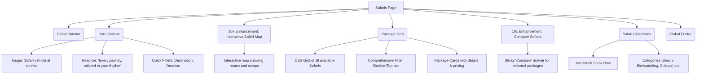

# Safaris Page Architecture

This document outlines the structural layout and wireframe of the Safaris Page, acting as the main catalog for curated travel packages.

## Component Tree

## Section Details & Enhancements (10x Perspective)
- **Filters**: Needs instant client-side filtering without page reloads to maintain a snappy, luxury feel.
- **Added 10x Element**: *Interactive Safari Map*. Users often struggle to understand geography. A beautiful map with animated lines showing flight/drive routes between camps adds immense clarity and premium value.
- **Added 10x Element**: *Compare feature*. Allowing users to select up to 3 safaris and view a side-by-side comparison of logistics, wildlife probabilities, and costs.
