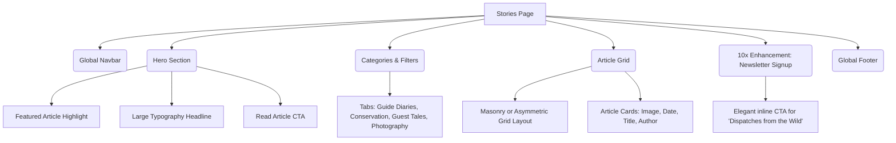

# Stories Page Architecture

This document outlines the structural layout and wireframe of the Stories Page, designed as an editorial journal for travel inspiration and guide diaries.

## Component Tree

## Section Details & Enhancements (10x Perspective)
- **Layout**: Avoid generic symmetric grids. Use asymmetrical card sizing (some span 2 columns, some 1) to give the feel of a premium travel magazine like Condé Nast Traveler.
- **Typography**: Heavy reliance on *Instrument Serif* for article titles to maintain the editorial aesthetic.
- **Added 10x Element**: *Newsletter Signup* specifically branded as "Dispatches from the Wild", shifting the tone from marketing spam to an exclusive insider club.
