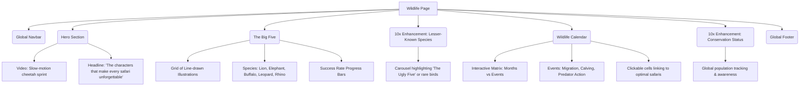

# Wildlife Page Architecture

This document outlines the structural layout and wireframe of the Wildlife Page, serving as an educational and inspirational hub for animal encounters.

## Component Tree

## Section Details & Enhancements (10x Perspective)
- **Big Five Illustrations**: Using editorial line art rather than stock photos keeps the page sophisticated and avoids the generic "zoo" look.
- **Interactive Calendar**: This is a powerful sales tool. Visualizing *when* things happen helps users decide *when* to book.
- **Added 10x Element**: *Lesser-Known Species*. True luxury is about expertise. Highlighting rare or niche wildlife shows deep local knowledge.
